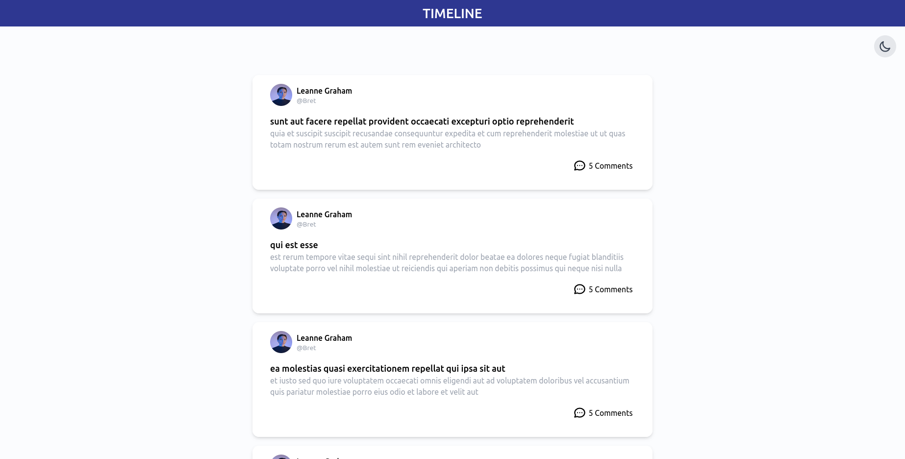
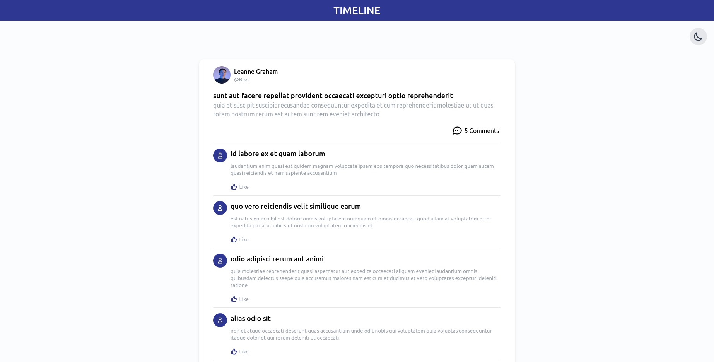
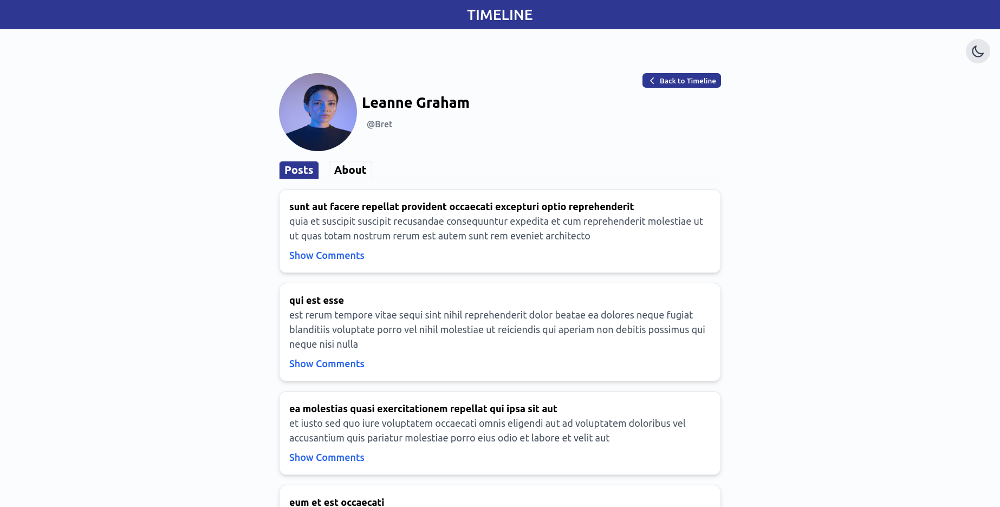
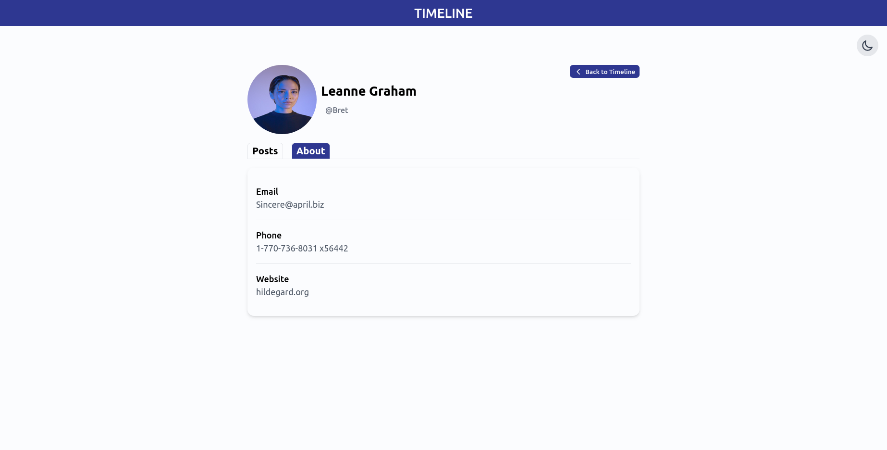
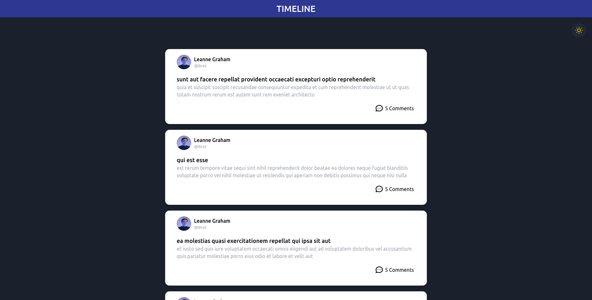

# Timeline app (React)

## Available Scripts

In the project directory, you can run:

### `npm install`

After installing npm run
### `npm start`

This will autometically load the page on [http://localhost:3000](http://localhost:3000) in browser.
### Output
## Timeline Page

## Commnets

## UserDetail

## Dark mode

### Best practices for this project
- **Component Structure** :  The code is organized into separate component files under the components and FormComponents directories to promote reusability and separation of concerns.React functional components are used for their simplicity and performance benefits over class-based components.

- **Code Style**: Consistent naming conventions are used for components and functions, which improves readability and maintainability.Comments are included to explain the purpose of complex logic or important parts of the code, such as dynamic renderings and conditional styles.

- **React Best Practices**: Props are used for dynamic data rendering Ensures that all elements created in a map function have a unique key prop to optimize React's rendering process.

- **Performance Optimization**: Implements conditional rendering within components to enhance UI performance and user experience.The application parses and manipulates JSON data efficiently, ensuring quick rendering and updates to show on the table.
- **Development Practices**: Effective use of Git for version control, with clear commit messages and organized branches.

